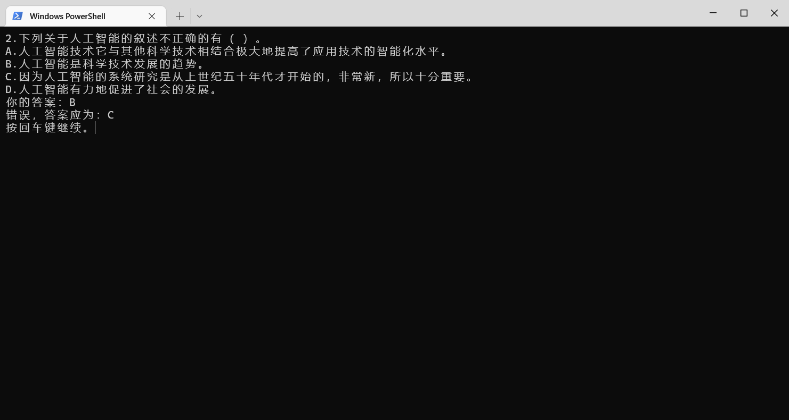

# 快速自测
> 用于考前各种类型选择题的自测

<p>
  <a href="https://raw.githubusercontent.com/songquanpeng/quick-quiz/main/LICENSE">
    
  </a>
  <a href="https://github.com/songquanpeng/quick-quiz/releases/latest">
    
  </a>
  <a href="https://github.com/songquanpeng/quick-quiz/releases/latest">
    
  </a>
</p>

可在 [Release 页面](https://github.com/songquanpeng/quick-quiz/releases)下载最新版本（Windows，macOS，Linux）。

## 使用方法
按照 `data.txt` 中的格式组织内容，之后双击 `quiz.exe` 即可开始自测。

## 展示


## 打包
```
pip install -r requirements.txt
pyinstaller -F ./main.py -n quiz
```